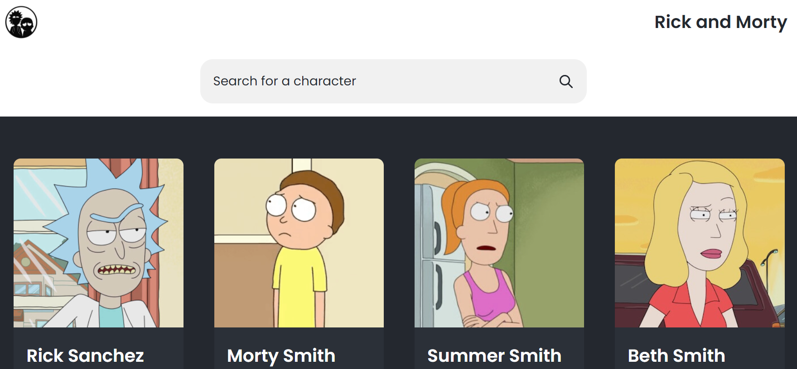

# **Rick and Morty Single Page Application**

This application was made using the [Rick and Morty API]("https://rickandmortyapi.com/api/character"). It reads the API and get the characters. As an user you can:

- Search for a character
- Select a character
- Select next page

**See the final result [here](https://jrigoo-rick-morty.netlify.app/)🔥🔥🔥**
